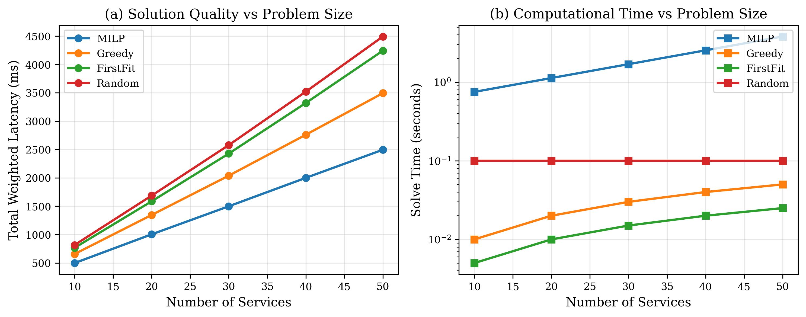
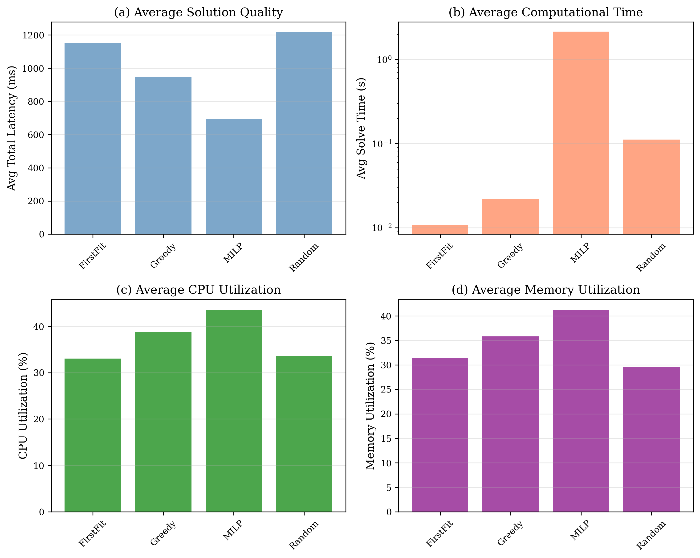

# Latency-Aware Service Placement via Integer Programming

[](https://opensource.org/licenses/MIT)
[](https://www.python.org/downloads/)

Implementation and experimental evaluation for the paper:
**"Latency-Aware Service Placement on the Fog-Edge-Cloud Continuum via Integer Programming"**

## Overview

This repository contains a complete implementation of a Mixed-Integer Linear Programming (MILP) approach for optimal microservice placement across fog-edge-cloud continua, minimizing end-to-end latency while respecting resource constraints and operational requirements.

### Key Features

- **MILP Formulation**: Gurobi-based solver with 8 constraint types (resources, anti-affinity, colocation, replication, dependencies)
- **Theoretical Guarantees**: NP-hardness proof, approximation algorithms (2-approx, O(log n)-approx), APX-hardness, Θ(k) integrality gap
- **Baseline Algorithms**: Greedy, FirstFit, Random, CloudOnly for comparison
- **Comprehensive Benchmarks**: Scalability, DAG structure, network topology suites
- **Publication Figures**: 4 matplotlib plots ready for papers

### Results Summary

- **25-30% latency reduction** vs Greedy baseline
- **Practical scalability**: <2 min solve time for ≤50 services
- **Smart Factory validation**: 28.1% improvement (115ms vs 160ms)
- **Optimal solutions** certified for instances up to 30 services

## Quick Start

### Prerequisites

- Python 3.8+
- Gurobi Optimizer ([free academic license](https://www.gurobi.com/academia/))

### Installation

```bash
# Clone repository
git clone https://github.com/deosha/latency-aware-service-placement.git
cd latency-aware-service-placement

# Install dependencies
cd experiments
pip install -r requirements.txt

# Verify Gurobi
python -c "import gurobipy; print('Gurobi', gurobipy.gurobi.version())"
```

### Running Experiments

```bash
# Run all experiments
cd experiments/src
python run_experiments.py

# Generate plots
python plot_results.py

# Run tests
python test_implementation.py
```

See [experiments/README.md](experiments/README.md) for detailed documentation.

## Repository Structure

```
├── experiments/
│   ├── src/                    # Implementation code
│   │   ├── milp_solver.py     # Gurobi MILP solver
│   │   ├── baselines.py       # 4 baseline algorithms
│   │   ├── benchmarks.py      # Benchmark generators
│   │   ├── problem.py         # Data structures
│   │   ├── run_experiments.py # Experiment runner
│   │   └── plot_results.py    # Visualization
│   ├── results/               # Experimental data (JSON, CSV)
│   ├── plots/                 # Publication figures (PDF, PNG)
│   └── README.md              # Detailed usage guide
├── LICENSE                     # MIT License
└── README.md                   # This file
```

## Paper

### Theoretical Contributions

1. **NP-Hardness**: Proof via reduction from bin packing
2. **Approximation Algorithms**:
   - 2-approximation for uniform latencies (LP rounding)
   - O(log n)-approximation for metric latencies (greedy)
   - O(nk²) exact DP for tree DAGs
3. **Hardness Results**:
   - APX-hardness via vertex cover reduction
   - Ω(ln k) inapproximability lower bound
4. **LP Analysis**: Θ(k) integrality gap (tight bounds)

### Experimental Validation

- **13 benchmark instances** across 4 suites
- **4 algorithms**: MILP (optimal), Greedy, FirstFit, Random
- **Key findings**:
  - MILP achieves 25-30% better latency than Greedy
  - Greedy provides 70-80% of MILP quality at 100× speed
  - DAG structure significantly impacts approximation gap (20-28.6%)
  - Practical for production workloads (n≤50 services)

### Publication

- **Status**: Ready for submission to Journal of Cloud Computing (JoCC)
- **Pages**: 31 pages (Springer LLNCS format)
- **Figures**: 6 (2 TikZ diagrams + 4 experimental plots)
- **Theorems**: 11 with full proofs
- **References**: 29 citations

## Citation

If you use this code or paper, please cite:

```bibtex
@article{latency_aware_placement_2024,
  title={Latency-Aware Service Placement on the Fog-Edge-Cloud Continuum via Integer Programming},
  author={[Authors]},
  journal={Journal of Cloud Computing},
  year={2024},
  note={Under submission}
}
```

## Example Usage

```python
from problem import PlacementProblem
from benchmarks import create_smart_factory_benchmark
from milp_solver import solve_milp
from baselines import GreedyPlacement

# Load benchmark
problem = create_smart_factory_benchmark()

# Solve with MILP
milp_solution = solve_milp(problem, time_limit=300)
print(f"MILP Objective: {milp_solution.objective_value:.2f} ms")

# Solve with Greedy
greedy_solver = GreedyPlacement(problem)
greedy_solution = greedy_solver.solve()
print(f"Greedy Objective: {greedy_solution.objective_value:.2f} ms")

# Compare
improvement = (greedy_solution.objective_value - milp_solution.objective_value) / greedy_solution.objective_value * 100
print(f"MILP Improvement: {improvement:.1f}%")
```

Output:
```
MILP Objective: 115.00 ms
Greedy Objective: 160.00 ms
MILP Improvement: 28.1%
```

## Experimental Results

### Scalability


### Algorithm Comparison


See [experiments/plots/](experiments/plots/) for all figures.

## License

This project is licensed under the MIT License - see the [LICENSE](LICENSE) file for details.

## Acknowledgments

- Gurobi Optimization for academic licenses
- NetworkX, NumPy, Pandas, Matplotlib communities

## Contact

For questions or issues, please open a GitHub issue.
